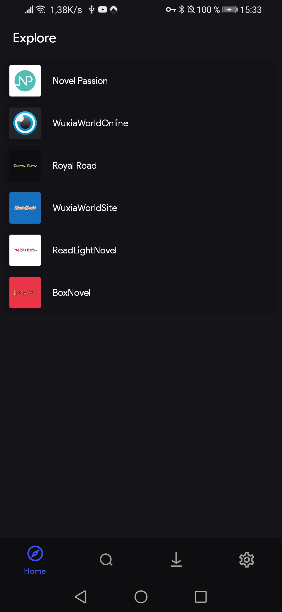
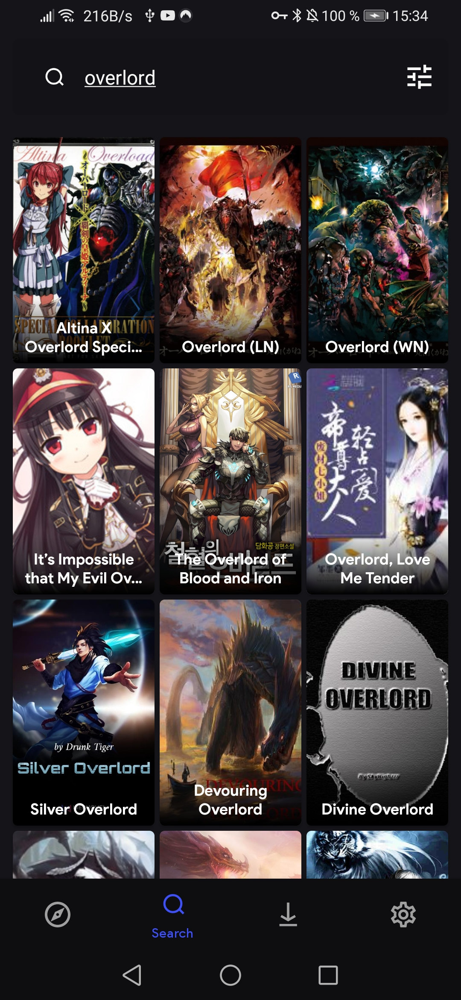
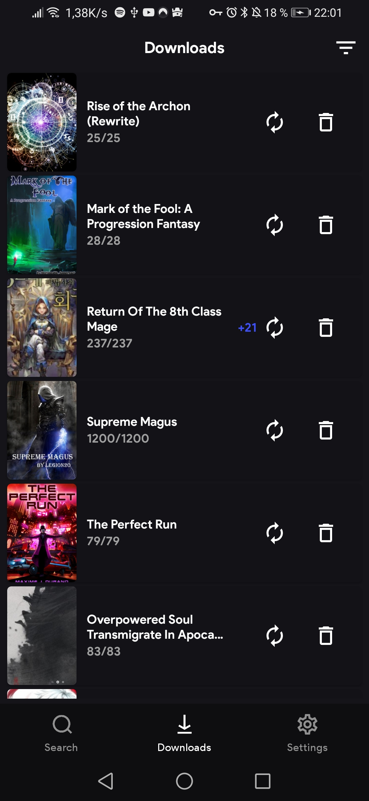
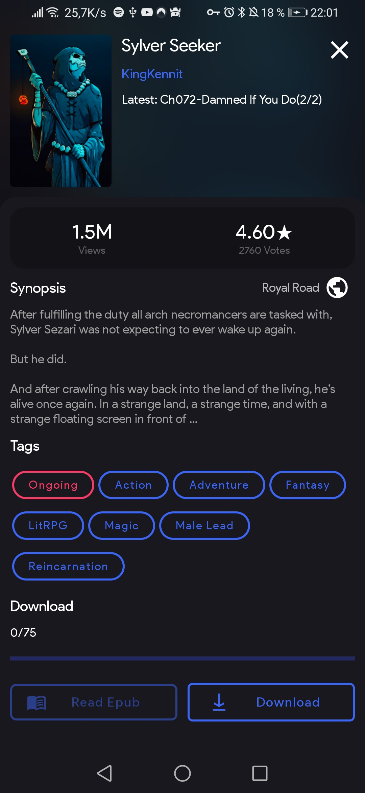
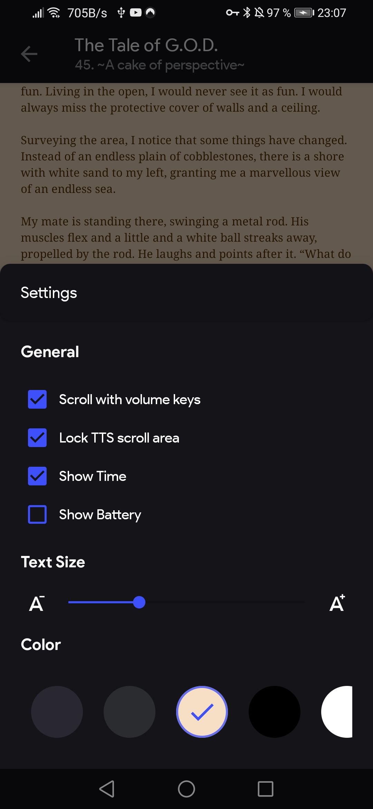

# QuickNovel

[English](README.md) | **Русский**

Бесплатное Android-приложение с открытым исходным кодом (FOSS) для скачивания новелл без рекламы. Также работает как читалка Epub-файлов.

**Discord:** https://discord.gg/5Hus6fM

**Скачать:** https://github.com/LagradOst/QuickNovel/releases

**Используемые провайдеры:**

- https://allnovel.org
- https://annas-archive.org
- https://bestlightnovel.com
- https://freewebnovel.com
- https://www.fanmtl.com
- https://graycity.net
- https://hiraethtranslation.com
- https://indowebnovel.id
- https://kolnovel.com
- https://libread.com
- https://lightnovelstranslations.com/Li
- https://meionovels.com
- https://risenovel.com
- https://readonlinefreebook.com
- https://www.mtlnovels.com
- https://novelbin.com
- https://novelfull.com
- https://novelsonline.org
- https://novlove.com/
- https://novelfire.net/
- https://pawread.com
- https://readfrom.net
- https://readnovelfull.com
- https://www.royalroad.com
- https://sakuranovel.id
- https://www.scribblehub.com
- https://wtr-lab.com
- https://www.wuxiabox.com/

**Скриншоты:**

**Юридическое уведомление:**

Любые юридические вопросы, касающиеся контента в этом приложении, следует решать непосредственно с самими хостами файлов и провайдерами, так как мы не аффилированы с ними.

В случае нарушения авторских прав, пожалуйста, напрямую свяжитесь с ответственными сторонами или веб-сайтами потоковой передачи.

Приложение предназначено исключительно для образовательных и личных целей.

QuickNovel не размещает любой контент в приложении и не контролирует, какой медиа-контент загружается или удаляется. QuickNovel функционирует как любой другой поисковый движок, например Google. QuickNovel не размещает, не загружает и не управляет никакими видео, фильмами или контентом. Он просто обрабатывает, агрегирует и отображает ссылки в удобном, дружелюбном для пользователя интерфейсе.

Он просто собирает данные с сайтов третьих сторон, которые общедоступны через любой обычный веб-браузер. Пользователь несёт ответственность за избегание любых действий, которые могут нарушать законы, регулирующие его/её местоположение. Используйте QuickNovel на свой страх и риск.
